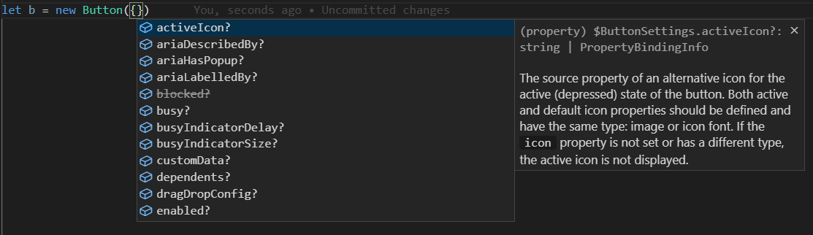
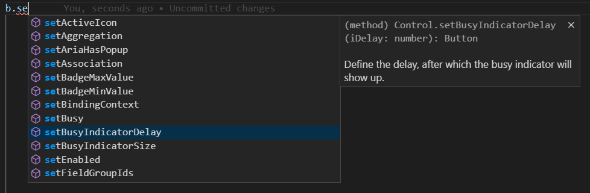

# Using TypeScript in UI5 Apps

## Table of Contents

- [Brief TypeScript Introduction](#brief-typescript-introduction)
- [The Type Definition Files provided for UI5](#the-type-definition-files-provided-for-ui5)
- [How does TypeScript UI5 Code look? - The Sample App in TypeScript](#how-does-typescript-ui5-code-look---the-sample-app-in-typescript)
- [Writing UI5 Apps in TypeScript](#writing-ui5-apps-in-typescript)
- [Converting UI5 Apps from JavaScript to TypeScript](#converting-ui5-apps-from-javascript-to-typescript)
- [Resources](#resources)

<br>
<br>


## Brief TypeScript Introduction

TypeScript is:
- JavaScript <b>plus types</b>
- Purely used at development time (NOT understood by browsers at runtime, so there must be a build step before running it)
- Developed by Microsoft, but open-source and widely adopted

The basic assignment of a type (here: "number") to a variable looks like this:
```ts
var someNumber: number;
```
But of course there are more language constructs, used for defining structured types, classes, enums and so on. For a real introduction to TypeScript with tutorials and an [online playground](https://www.typescriptlang.org/play?#code/PQKgUABCEIYQbjATgSxgIwDYFNImGIkhAM4D2AttgHICuF62SAXBAHb2NIDcYYoeWBABmtNgGMALijJs8BUROmyIFWpmkAHTAE8AFAA9WHBkwA0EHcc5MAlBADekCEmyTaSNhANRLvAL58Ar5w4pgwJCTyYGERJBAA4q5uTI7OEBAA5snSbJmsJJKoebzpEOKyhUi0UmTEelSRMJnYBUUoefZOGT09kgAWKCQAdNnYbh2ZEAC8qthNLby9gb1lY256XWW9ru6eEABEABLYmJhkFgcQANQQA0OjOZNLPYGBYEA), head over to the language homepage at [www.typescriptlang.org](https://www.typescriptlang.org
). They also offer a handy [5-minutes introduction for JavaScript developers](https://www.typescriptlang.org/docs/handbook/typescript-in-5-minutes.html).

When developers write TypeScript code, the type information is scattered across the code. But one can also create separate type definition files for already existing JavaScript libraries. Such files have the extension `*.d.ts` and these are exactly what we are providing for UI5 now. For many other JavaScript libraries such type definition files can be found at [definitelytyped.org](https://definitelytyped.org/). 


## The Type Definition Files provided for UI5

The SAPUI5 type definitions are [provided via npm](https://www.npmjs.com/package/@sapui5/types) under the name "@sapui5/types". The OpenUI5 subset is available as "[`@openui5/types`](https://www.npmjs.com/package/@openui5/types)" and also made available by DefinitelyTyped as "[`@types/openui5`](https://www.npmjs.com/package/@types/openui5)" (for the differences, which are related to the versioning, see [this explanation](https://github.com/DefinitelyTyped/DefinitelyTyped/blob/master/types/openui5/README.md#versioning)). There is one *.d.ts file per UI5 library.

IMPORTANT: As we want to enable and promote using modern JavaScript, these *.d.ts files are written in a way that supports loading UI5 module with [ES module syntax](https://developer.mozilla.org/de/docs/Web/JavaScript/Guide/Modules) (instead of using the UI5 API `sap.ui.require(...)` or `sap.ui.define(...)`) and defining classes with [ES class syntax](https://developer.mozilla.org/en-US/docs/Web/JavaScript/Reference/Classes) (instead of using the UI5 API `SomeClass.extend(...)`)). If you use our `*.d.ts` files, this is how you should write your UI5 apps.


### Limitations

- The type definitions are work in progress with NO COMPATIBILITY GUARANTEES! Changes will happen.
- The string syntax for bindings is not supported yet. This means instead of e.g. `new Button({text: "{myModel>someText}"})` one has to use the object syntax to prevent TypeScript from complaining: `new Button({text: {path: "myModel>someText"}})`
- The types of UI5 API parameter and return values are not always precisely defined. This happens especially for nested structures and for the types with which Promises resolve. This is because the type definition files are generated from the regular JSDoc documentation, which not always has complete `@param` definitions, but occasionally explains some parts in plaintext instead. When you notice a place where types are not fully defined, [please open a GitHub issue](https://github.com/SAP/openui5/blob/master/CONTRIBUTING.md#report-an-issue). Fixing it will not only improve the TypeScript experience, but also make our regular API documentation more precise.
- There is no support yet for automatically defining the API of custom controls.


## How does TypeScript UI5 Code look? - The Sample App in TypeScript


### Overview of TypeScript-relevant Parts of the Project:
- The [packages/ui-form/webapp](../packages/ui-form/webapp) directory contains the TypeScript implementation of the UI5 app. See the next section for details of a controller implementation inside this directory.
- The [packages/ui-form/tsconfig.json](../packages/ui-form/tsconfig.json) file defines TypeScript compiler options like the JavaScript target version, the location of the `*.d.ts` files and the source and target directory for the TypeScript compilation. 
- The [packages/ui-form/.babelrc.json](../packages/ui-form/.babelrc.json) file controls the build steps (first TypeScript to ES6 ("modern" JavaScript), then the conversion of some ES6 language constructs (module imports, classes) to the UI5 way of resource loading and class definition)  
- The [packages/ui-form/package.json](../packages/ui-form/package.json) file contains the `build:ts`and `watch:ts` scripts for yarn which trigger TypeScript compilation and live serving (used from within yarn scripts inside the [top-level package.json](../package.json) file).


### The Most Important Controller in Detail
Most of the application logic is implemented in the [Registration.controller.ts](../packages/ui-form/webapp/controller/Registration.controller.ts) file. For a general explanation of this file, please check the [documentation in the main branch of this repository](https://github.com/SAP-samples/ui5-cap-event-app/blob/main/docs/documentation.md#The-Heart-of-the-App-the-Registration-Controller), which describes the JavaScript version of the controller in detail. The logic is the same in TypeScript and most of the code as well - after all TypeScript is a superset of JavaScript which "only" adds type information. So let's look at the differences only:


#### Module Loading

The controller file starts with code not typically seen in UI5 apps: importing modules. But this is not TypeScript-specific at all, it's just the modern JavaScript we want to promote:
```js
import Controller from "sap/ui/core/mvc/Controller";
import MessageBox from "sap/m/MessageBox";
import MessageToast from "sap/m/MessageToast";
...
```
This part is transformed to the well-known `sap.ui.define(...)` or `sap.ui.require(...)` in addition to the TypeScript compilation.


#### Type Definitions

The next section consists of pure TypeScript: the definition of certain structures used within the controller:
```ts
type Person = {
	LastName: string,
	FirstName: string,
	Birthday: string
};
...
```
Not all apps use structures like these. But if they do, defining the types provides all the type safety and code completion goodies which TypeScript is good for.


#### Class Definitions

Then, the controller class is defined, inheriting from `sap.ui.core.mvc.Controller`. This is again just modern JavaScript instead of the UI5-proprietary `Controller.extend(...)`. Also how the member methods like `onInit()` and the private member variables like `oBundle` are defined has nothing to do with TypeScript. The only pieces of TypeScript in this section of the controller code are how the private member variables and the `onInit` method are typed (e.g. `oBundle` is defined to be of type `ResourceBundle`).

```ts
/**
 * @namespace sap.ui.eventregistration.form.controller
 */
export default class Registration extends Controller {

	private bundle : ResourceBundle;
	private oDataModel : ODataModel;

	public onInit() : void {
```


#### Controller Implementation Code

Within the actual controller implementation, there is very little TypeScript-specific code!

TypeScript code is found for example after method parameters: they need to be typed explicitly - here `aContexts` is an array of OData V4 contexts:
```ts
public onExistingDataLoaded(contexts : V4Context[]) : void {
	...
}
```

Local variables are sometimes implicitly typed via the assigned value (`this.bundle` has type `ResourceBundle`, so TypeScript knows this is also the type of the local variable `bundle`):
```ts
const bundle = this.bundle;
```
But sometimes the type is specified explicitly, e.g. when there is no immediate assignment to the newly declared variable:
```ts
let prop : PersonProp;
```


In some places there is a typecast using the "`as`" keyword, mostly when calling getters like `getModel()` which returns the superclass `sap.ui.model.Model` (the actual instance may be a `ResourceModel` or an `ODataModel`). Or `byId(...)`, which returns `sap.ui.core.Element`, while the returned element may - depending on the ID - be a `sap.m.Button`:
```ts
this.oDataModel = this.getOwnerComponent().getModel() as ODataModel;
...
(this.byId("submitButton") as Button).setEnabled(true);
```
NOTE: Many typecasts like the first one here will become unnecessary once these getter methods make use of generics (this is work in progress). Then it will be sufficient to specify the type of the left-hand side variable (here: `this.oDataModel`).
<br>
<br>
Actually, that's it!<br>
As of writing, the entire controller implementation is almost pure JavaScript with only a dozen typecasts and a dozen type definitions for variables as TypeScript-specific code! So TypeScript is not a new language on its own, but merely an addition which may come with minimal effort, but lots of benefits.


## Writing UI5 Apps in TypeScript

### Setup

Please refer to the [TypeScript Hello World app](https://github.com/SAP-samples/ui5-typescript-helloworld) and in particular to the [step-by-step setup explanation](https://github.com/SAP-samples/ui5-typescript-helloworld/blob/main/step-by-step.md) to understand the overall project setup for developing TypeScript-based UI5 apps.<br>
You can also use that app as copy template for getting started quickly.

### Code

1. Before writing UI5 application code, learn the fundamentals of TypeScript. The [official webpage of the language contains a "handbook"](https://www.typescriptlang.org/docs/handbook/intro.html) and even a quick [5-minutes introduction for JavaScript developers](https://www.typescriptlang.org/docs/handbook/typescript-in-5-minutes.html) which will help.
2. Then, for an impression how UI5 app code written in TypeScript looks, check out the [section above which walks you through the Registration controller code](#how-does-typescript-ui5-code-look---the-sample-app-in-typescript).
3. Then - code! Import modules and define classes using the ES6 syntax. <b>Write the rest of the code like you would normally do in JavaScript!</b> Whenever you need to do something for TypeScript, an error message will tell you! (this requires one of the many TypeScript-aware code editors like VSCode)

#### Typical TypeScript Errors

These are the errors you will encounter most often - and how to solve them.

When TypeScript cannot find out the type of a variable on its own, specify it:<br><br>


Solution:
```ts
public onExistingDataLoaded(contexts : V4Context[]) {
```


When TypeScript complains about a type missing certain properties, it means that the types do not match. This even happens sometimes when a typecast to a specific subclass is required:


Solution:
```ts
const oDataModel : ODataModel = this.getOwnerComponent().getModel() as ODataModel;
```

When you are missing a certain mathod in code completion or you try to call this method and TypeScript complains about the method not existing, it may be needed to cast to the specific type you are using:


Solution:
```ts
(this.byId("submitButton") as Button).setEnabled(true);
```

Most other errors you will encounter might actually point you to real issues in the code! That's what TypeScript is for.


Now enjoy also the other benefits of TypeScript, like the code completion and inline documentation, e.g. for constructors:




...or for method calls:




#### Good to Know

- When you import the `sap.ui.core.Core` class, you get the singleton instance of the core, just like when you use `sap.ui.require(...)`:
  ```ts
  import Core from "sap/ui/core/Core";
  ...
  Core.byId("myButton");
  ```

- Make sure to avoid collisions. The type `Event` is already defined as browser event, so you might want to locally name it `UI5Event`:
	```ts
	import UI5Event from "sap/ui/base/Event";
	```


- Often there is a 1:1 relationship between the classes you want to use and the modules to load, so most imports in UI5 apps will look like this, loading a class which is the default export of a module:
	```ts
	import Button from "sap/m/Button";
	```
	But there are also modules with multiple exports where you may want to pick a specific one: 
	```ts
	import { URLHelper } from "sap/m/library";
	import { CSSColor, ValueState, SortOrder } from "sap/ui/core/library";
	import MessageBox, { Action as MessageBoxAction } from "sap/m/MessageBox";
	import { support } from "sap/ui/Device";
	```
	This is mostly the case for all types defined in library.js files (e.g. many of the enums) and also enums defined within controls.<br>
	And of course there are also modules (especially in low-level parts of the core) which define functions to use:
	```ts
	import syncStyleClass from "sap/ui/core/syncStyleClass";
	```

- If you need to use jQuery directly, you can import it like this:
	```ts
	import jQuery from "sap/ui/thirdparty/jquery";
	```


### Check the Code

You can run a TypeScript check of the app from the command line with:
```
yarn verify:ui-form
```
This will run a test compilation of the app and output any TypeScript errors.

You can also lint the TypeScript code with:
```
yarn lint:ui-form
```


### Run the App

As the [regular documentation](../README.md#running-the-project) explains, you can run the app in development ("watch") mode with:
```
yarn start
```
or if you only want to run the ui-form app:
```
yarn start:ui-form
```


### Build

As the [regular documentation](../README.md#building-the-project) explains, you can build the app with:
```
yarn start
```
This includes the TypeScript compilation.


### Debug

In the debugger of browsers, you can step through the original TypeScript code you wrote:


This is achieved by generating sourcemaps, which contain the original code and information to which place in that original code the actually executed JavaScript statements belong. At least in Chrome, the TypeScript version of the code is automatically opened when a breakpoint is hit, even when that breakpoint was set in the JavaScript version of a file. If you can't see the TypeScript code, make sure sourcemaps are enabled in the settings of your browser's developer tools.


### Additional Considerations

#### Performance

One concern when using TypeScript might be whether runtime performance or code size is affected by using TypeScript instead of JavaScript. The short anwer is: no.<br>

The slightly longer answer is: the browser anyway executes the compiled JavaScript, not TypeScript. And the compilation for the most part just removes the type information, so the compiled code is pretty much the same as when you write JavaScript directly. No size penalty, no additional logic. This is not an exhaustive answer, just a rule of thumb.

For example, as of writing, the Registration controller has 265 lines of code in TypeScript, which are compiled to 226 lines of JavaScript (without minification). The controller written in native JavaScript has 230 lines of code.

The <i>compilation</i> performance should not be a concern because it is barely noticeable in small to medium projects. If it becomes one in huge projects, there are [certain hints](https://github.com/microsoft/TypeScript/wiki/Performance) available how to lower compilation time.

#### Type Checks at Runtime

Remember that TypeScript does NOT ensure type correctness at runtime. Despite all compile-time checks, wrongly typed values can still sneak in at runtime, e.g. from JSON API calls to external systems which return an unexpected structure. Those will then lead to the same kind of issues occurring in regular JavaScript apps. Any runtime type checks you want need to be done by you.


## Converting UI5 Apps from JavaScript to TypeScript

Let's say you have an existing JavaScript UI5 app and want to convert it to TypeScript: what are the steps and efforts?

The general process is to walk through the below steps, guided by the TypeScript errors displayed in the editor (and reported by running `yarn verify-app`).

### 1. Structural Code Changes: Module Loading and Class Definition

These steps are not really related to TypeScript, but convert the code into the more modern JavaScript syntax suppoted by the UI5 type definition files.

The first step is to convert class definitions from the proprietary UI5 syntax to ES class syntax.

From:
```js
var App = Controller.extend("ui5tssampleapp.controller.App", {
	onInit: function _onInit() {
		// apply content density mode to root view
		this.getView().addStyleClass(this.getOwnerComponent().getContentDensityClass());
	}
});
```
To:
```js
/**
 * @namespace ui5tssampleapp.controller
 */
class App extends Controller {
	public onInit() {
		// apply content density mode to root view
		this.getView().addStyleClass((this.getOwnerComponent()).getContentDensityClass());
	};
};
```
It is important to annotate the class with the namespace, so the back transformation can re-add it.


The second step is to convert the dependency loading (`sap.ui.require(...)`) to ES module syntax. Many of the JS files in a typical UI5 app actually do not only require dependencies, but also provide a new class on their own - often a controller. In this case `sap.ui.define(...)` is replaced with ES module imports <i>and</i> a module export.

In the above example, this looks as follows.

Before:

```js
sap.ui.define(["sap/ui/core/mvc/Controller"], function (Controller) {
	/**
	 * @namespace ui5tssampleapp.controller
	 */
	class App extends Controller {
		... // as above
	};

  return App;
});
```

After:

```js
import Controller from "sap/ui/core/mvc/Controller";

/**
 * @namespace ui5tssampleapp.controller
 */
export default class App extends Controller {
	... // as above
};
```

### 2. Standard TypeScript Code Adaptations

- Add type information to method parameters.
- Add private member class variables (with type information) to the beginning of the class definition. (In JavaScript they are often created on-the-fly later on during the lifetime of a class instance.)
- Convert conventional functions to arrow functions when `someFunction.bind(...)` is used because TypeScript does not seem to propagate the type of the bound "this" context into the function body.
- Define further types and structures needed withing the code, if applicable.

Hint: use the most precise type to have all properties available. Examples:
- Use specific types like `KeyboardEvent`, not just `Event` for browser events.
- Use `JQuery.DropEvent`, not `JQuery.Event` or `JQueryEventObject` or just `Event` when `event.originalTarget` is needed.
- Use `JQueryXHR`, not `XMLHttpRequest`.
- ...

### 3. Casts for Return Values of Generic Methods

Generic getter methods like `document.getElementById(...)` are commonly defined to return the super-type of all possible types (in this case `HTMLElement`) although in practice it will usually be a specific sub-type (e.g. an `HTMLAnchorElement`).

In many cases you will have to cast the return value to the specific type to use it.

The same is valid for several UI5 methods, most prominently the following:
- core.byId() / view.byId()
- control.getBinding()
- ownerComponent.getModel()
- event.getSource()
- component.getRootControl()  
- this.getOwnerComponent()
 
This cast will sometimes also require an additional module import to make the type known. Sometimes this will be offered as "quick fix" by the code editor, sometimes it will have to be done manually.

Coming back to the app controller example used above, this step will complete the TypeScript conversion: an additional import of the app's component is needed (called `AppComponent`), so within the `onInit` implementation the required typecast can be done. Without this typecast, the return type of `getOwnerComponent` would be a `sap.ui.core.Component`, which does not have the `getContentDensityClass` method defined in the app component.

Before:
```js
import Controller from "sap/ui/core/mvc/Controller";

/**
 * @namespace ui5tssampleapp.controller
 */
export default class App extends Controller {

	public onInit() {
		// apply content density mode to root view
		this.getView().addStyleClass(this.getOwnerComponent().getContentDensityClass());
	};

};
```

After:
```ts
import Controller from "sap/ui/core/mvc/Controller";
import AppComponent from "../Component";

/**
 * @namespace ui5tssampleapp.controller
 */
export default class App extends Controller {

	public onInit() : void {
		// apply content density mode to root view
		this.getView().addStyleClass((this.getOwnerComponent() as AppComponent).getContentDensityClass());
	};

};
```

For this controller file, the TypeScript conversion is now complete (and the actual TypeScript part of the conversion is the typecast).

(Note: the "void" definition of the method return type is not strictly demanded by TypeScript, but by the current linting settings.)

### 4. Solving the Remaining Issues You Might Face

At this point, the number of remaining TypeScript errors should be reduced to a small minority.

Some of the [limitations](#limitations) listed above can lead to TypeScript errors which are left after the above steps. E.g. when some complex types in method return values are not completely defined. This means you will not get code completion nor a type for these values. You are welcome to [report an issue at GitHub](https://github.com/SAP/openui5/blob/master/CONTRIBUTING.md#report-an-issue) to let us know, so we can improve the documentation. The same is recommended when a method has parameters which are not marked as optional, but can be omitted.


### Conversion Learnings

From our own app conversions for testing, we can say that the effort for converting small apps with 5-6 views and controllers to TypeScript is really limited (few hours).

While doing so, we have found (and fixed) a few places in the UI5 type definitions which were not 100% defined (usually no problem, as easy workarounds like explicitly giving a type are possible),  but we have also found a few actual bugs in the application code, e.g. calling methods with wrong or missing parameters, access to private methods/variables of controls, or just typos.


## Resources

There has been a preview on TypeScript in a "UI5ers live" web conference. You can access the recording [on YouTube](https://www.youtube.com/watch?v=0notj9PPTho).

The [UI5 TypeScript Hello World app](https://github.com/SAP-samples/ui5-typescript-helloworld) is a great place to learn how the project setup works.
